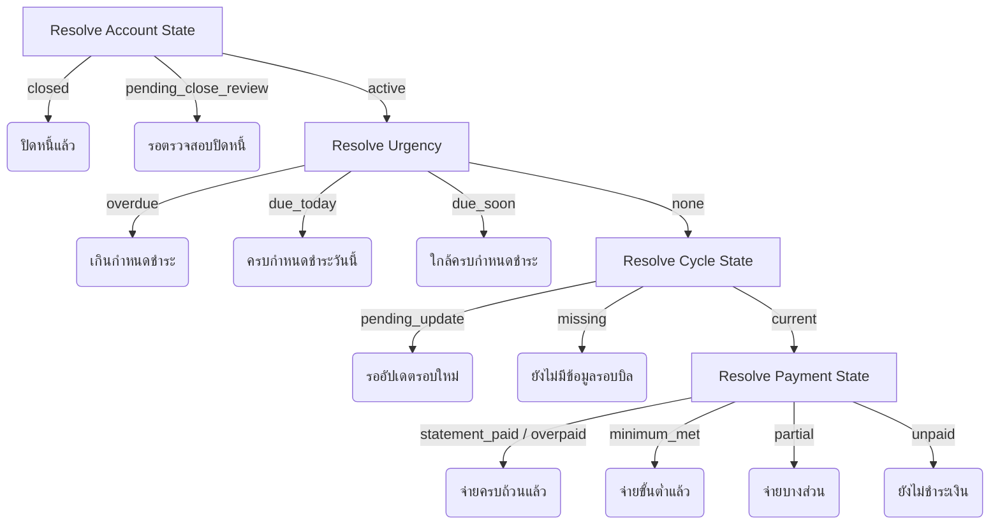

# TangLak: Debt Cycle Lifecycle UX Specification

This document defines the complete debt lifecycle state model, billing cycle rollover flows, transition rules, payment semantics, and layout guidelines for debt management in TangLak.

---

## 1. Lifecycle State Model

To handle overlapping states, TangLak separates the state of a debt into four orthogonal dimensions. This avoids a flat, mutually exclusive enum and allows for richer, more context-aware UI messaging.

### The Four State Dimensions

```
                       +---------------------------+
                       |   Account Lifecycle State |
                       |   (active/review/closed)  |
                       +-------------+-------------+
                                     |
      +------------------------------+------------------------------+
      |                              |                              |
+-----+-----+                  +-----+-----+                  +-----+-----+
| Cycle State |                | Payment State |                |   Urgency   |
| (missing/   |                | (unpaid/      |                | (none/soon/ |
| current/    |                | partial/      |                | today/      |
| pending)    |                | met/paid)     |                | overdue)    |
+-------------+                  +-----------+                  +-----------+
```

1.  **Account Lifecycle State**:
    *   `active`: The account is active and open.
    *   `pending_close_review` (รอตรวจสอบปิดหนี้): Total outstanding is 0, or installment count is 0, waiting for explicit user closure.
    *   `closed`: Explicitly closed by the user. Read-only.
2.  **Cycle State**:
    *   `missing`: Active debt, but no statement cycle data has been entered yet.
    *   `current`: Inside an active, unexpired cycle.
    *   `pending_update`: Statement cycle date has passed; waiting for the user to enter the next cycle's details.
3.  **Payment State**:
    *   `unpaid`: `paidThisCycle == 0`.
    *   `partial`: `0 < paidThisCycle < minimumPayment`.
    *   `minimum_met`: `minimumPayment <= paidThisCycle < statementAmount`.
    *   `statement_paid`: `statementAmount <= paidThisCycle < (statementAmount + epsilon)`.
    *   `overpaid`: `paidThisCycle > statementAmount`.
4.  **Urgency**:
    *   `none`: Current date is well before the due date.
    *   `due_soon`: Current date is within 3 days of `dueDate`.
    *   `due_today`: Current date is equal to `dueDate` (Bangkok Timezone).
    *   `overdue`: Current date is past `dueDate`, and payment state is `unpaid` or `partial`.

### Composite Badge Resolution

A single primary badge is displayed on the debt card and details page. It is resolved using the following priority:



---

## 2. Today Screen Next-Action Priority Logic

To prevent overwhelming the user, the `/today` screen displays **exactly one primary next-action card** (the highest priority across all debts). 

### Multi-Debt Urgency Resolution
*   If multiple debts require attention, the UI renders the single highest-priority next-action card.
*   Directly below the primary card, a small secondary text bar summarizes the remainder (e.g., `ยังมีอีก 2 รายการที่ต้องจัดการ`).
*   The text bar links directly to `/debts` (the monthly debt summary list).

### Action Priority Order
1.  **Overdue Minimum**: Urgency is `overdue` (Priority 1).
2.  **Due Today**: Urgency is `due_today` (Priority 2).
3.  **Due Within 3 Days**: Urgency is `due_soon` (Priority 3).
4.  **Minimum Not Yet Met**: Cycle state is `current` and Payment state is `unpaid` or `partial` (Priority 4).
5.  **New Cycle Waiting for Update**: Cycle state is `pending_update` (Priority 5).
6.  **No Due-Date Data**: Cycle state is `missing` (Priority 6).
7.  **Informational/Clean States**: Cycle state is `current` and Payment state is `minimum_met` or `statement_paid` (Priority 7).

### Tie-Break Rules
If two or more debts have the same priority status, resolve the tie-breaker in this strict order:
1.  **Larger remaining minimum** (ยอดขั้นต่ำคงเหลือมากกว่า).
2.  **Earlier due date** (วันครบกำหนดชำระมาถึงก่อน หรือเลยกำหนดมานานกว่า).
3.  **Higher annual interest rate** (อัตราดอกเบี้ยต่อปีสูงกว่า).
4.  **Deterministic stable fallback** (Creation order of the debt account in database).

---

## 3. Safe Payment Semantics (Phase 1 Rules)

In Phase 1, payments logged by the user **must not automatically reduce the total outstanding balance, credit limit, or interest rates**. All overall debt values must remain manual to prevent mismatch with actual bank interest charges.

### Formula Registry
The system calculates cycle-level metrics using these strict formulas:

$$\text{paidThisCycle} = \sum (\text{confirmed linked payments within cycle boundaries})$$

$$\text{remainingMinimum} = \max(\text{minimumPayment} - \text{paidThisCycle}, 0)$$

$$\text{remainingStatement} = \max(\text{statementAmount} - \text{paidThisCycle}, 0)$$

$$\text{overMinimum} = \max(\text{paidThisCycle} - \text{minimumPayment}, 0)$$

$$\text{overStatement} = \max(\text{paidThisCycle} - \text{statementAmount}, 0)$$

### Explanatory Disclaimer Copy
Because the total outstanding balance is not automatically updated, the UI must display the following explanatory text on the payment confirmation screen and the debt details page:
> "การบันทึกการชำระจะไม่ปรับยอดหนี้ทั้งหมดอัตโนมัติ กรุณาอัปเดตยอดล่าสุดจากแอปหรือใบแจ้งหนี้ของผู้ให้บริการ"

---

## 4. Late-Linked Payments

When a user retroactively links a payment to a closed cycle (e.g. mapping a forgotten bank slip from last month):

1.  **Recalculation Scope**: The system assigns the payment to the historical cycle based on the transaction date, recalculating `paidThisCycle`, `remainingMinimum`, and `remainingStatement` for that cycle.
2.  **Date/Amount Preservation**: The current active cycle's dates, statement amount, and minimum due remain completely unchanged.
3.  **No Balance Change**: The total outstanding balance must **not** change automatically.
4.  **Preserved Metadata**: The database must track:
    *   `transactionDate` (วันที่ทำรายการจริง)
    *   `dateLinked` (วันที่บันทึก/เชื่อมโยง)
    *   `affectedCycleId` (รอบบิลที่ได้รับผลกระทบ)
    *   `previousStatus` (สถานะรอบบิลเดิม)
    *   `recalculatedStatus` (สถานะหลังคำนวณใหม่)
5.  **Audit Copy**: The UI must display this audit warning label next to the late-linked payment:
    > "รายการนี้ถูกเพิ่มย้อนหลัง สถานะรอบบิลอาจเปลี่ยนตามวันที่ชำระ ค่าปรับหรือดอกเบี้ยที่เกิดขึ้นจริงให้ตรวจสอบจากผู้ให้บริการ"

---

## 5. Debt Closure & Installment Completion

A debt account must **never** auto-close under any circumstances (even if total outstanding reaches 0, remaining installments reaches 0, or AI labels suggest it).

### Closure Flow
```
[Total Outstanding is 0]
   --> Account state shifts to: pending_close_review (รอตรวจสอบปิดหนี้)
   
[User Taps: ตรวจสอบปิดหนี้]
   --> Displays confirmation modal.
   
[Confirmation Modal Displays warning]
   --> Wording: "ตรวจสอบยอดล่าสุดจากผู้ให้บริการแล้วหรือยัง? อาจยังมีดอกเบี้ย ค่าธรรมเนียม หรือรายการรอดำเนินการ กรุณายืนยันเมื่อยอดหนี้จริงเป็นศูนย์"
   
[User clicks: ยืนยันปิดหนี้]
   --> Account state changes to: closed.
   --> Account becomes read-only.
```

### Installment Completion Rules
*   When `remainingInstallments` reaches `0`, the system does **not** close the account.
*   The account transitions to `pending_close_review` (รอตรวจสอบปิดหนี้).
*   The user is prompted to verify if there is any real remaining balance. If yes, the user can update the balance and cycle dates. If no, they explicitly trigger the confirmation modal to close the debt.

### Post-Closure State
*   **Validation**: Negative outstanding balances are invalid and must be blocked upon entry.
*   **Visibility**: The closed debt remains visible under a "ประวัติบัญชีหนี้ที่ปิดแล้ว" (Closed Debts) tab on the debts page for audit records.
*   **Linking payments**: Late payments can still be linked to a closed debt but the UI must warn the user that the account is closed.
*   **Reopening**: Reopening closed debts is **not supported in Phase 1** (deferred to a future release).
