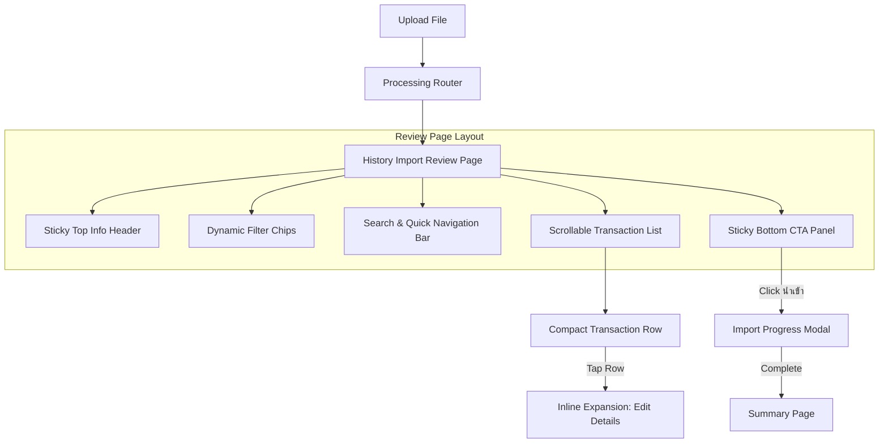
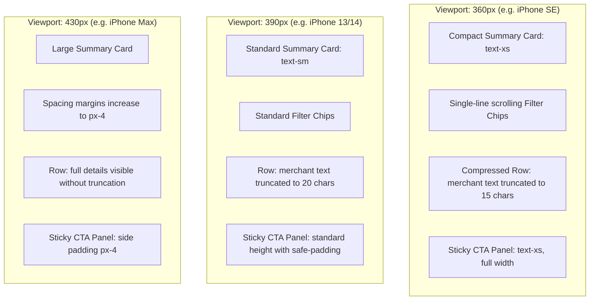
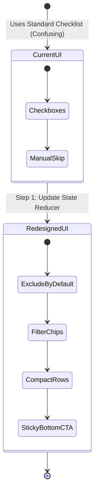

# UX Redesign Specification: History Import Review Board

This document defines the UX/UI redesign specification for the History Import Review screen in TangLak. The primary goal is to optimize the validation and import of large bank statement batches (up to 200+ rows) on mobile devices without changing the application's underlying logical database schemas or state constraints.

---

## 1. Current State Problems

The current history import review implementation has several severe usability and performance bottlenecks on mobile devices:

1. **Extreme Page Length**: Displaying 200+ expanded rows sequentially creates an excessively long scroll distance (often over 20,000px), leading to scroll fatigue and DOM lag.
2. **Confusing Inclusion Selection**: Checked checkboxes imply a list of items to "do something" to, whereas users typically want to import *everything* except a few specific rows. Standard checkbox behavior forces users to tap dozens of items just to exclude a few.
3. **Buried Import Call-to-Action (CTA)**: The main "Confirm Import" CTA is placed at the very bottom of the page. In a statement with 200+ items, the user is forced to scroll to the end of the page to find it.
4. **Poor Discoverability of Issues**: Low-confidence, duplicate, or invalid transactions are interspersed with clean rows. Users cannot easily filter or scan for elements that require active human correction.
5. **No Contextual Progress Feedback**: During long-running batch commits, the app does not provide granular visual steps, causing users to believe the app has frozen or crashed.

---

## 2. Information Architecture



### Key Layout Sections (Mobile First)
- **Top Summary Card**: Displays statement meta (Bank Name, Account, Date Range) and detected layout metadata.
- **Filter Chips**: Horizontally scrollable row showing counts of transactions belonging to specific review filters.
- **Search and Jump-to Bar**: Contains text input for text/merchant searches and buttons to jump directly to the next warning/unresolved item.
- **Scrollable Row Container**: Houses the grouped rows. Repeating metadata, e.g., page headers or balance forward rows, are hidden.
- **Sticky Bottom Action Panel**: Floats above the content at the bottom of the screen. Holds the overall counts, validation errors warning (if any), and the primary commit CTA.

---

## 3. Redesigned Interaction Model

### 3.1. Selection Model: "Exclude by Default"

Instead of a positive selection model where users select what they want, the redesigned flow implements a **negative selection model ("Import All by Default")**:

- All valid, duplicate-free rows are selected for import by default when the page loads.
- Checkbox/selection control is framed as **"ไม่นำเข้ารายการนี้" (Exclude this transaction)**.
- Excluded rows are visually styled with low opacity, strike-through text, and a distinct gray indicator.

#### Row Selection States Matrix

| Initial Row Status | Default Action | Selection UI State | Exclude Toggle Behavior |
| :--- | :--- | :--- | :--- |
| **Valid (Ready)** | Selected for import | Highlighted (Active) | Excludes row, dims text, updates counters |
| **Duplicate Found** | Deselected (Skip) | Dimmed / Crossed Out | Toggles to "Merge" or "Import Separately" |
| **Invalid (Missing Category/Data)** | Blocked (Unresolved) | Warning border (Expands) | Cannot import until edit form inputs are valid |

#### Bulk Controls
- **"เลือกทั้งหมด" (Select All)**: Sets all currently filtered rows to "นำเข้า" (Import).
- **"ยกเลิกทั้งหมด" (Exclude All)**: Sets all currently filtered rows to "ไม่นำเข้า" (Skip).
- **"ข้ามรายการซ้ำทั้งหมด" (Skip All Duplicates)**: Instantly marks all duplicate candidates in the batch to "ไม่นำเข้า" (Skip).

---

## 4. Component Breakdown & Mobile Layouts

### 4.1. Mobile Sticky Review Summary

The sticky bottom panel sits fixed above the bottom safe area of the viewport.

```
+-------------------------------------------------------------+
|  เลือก 219 จาก 220 รายการ | เงินเข้า: +฿25,000 | เงินออก: -฿12,400 |
|  [ นำเข้า 219 รายการ ]                                       |
+-------------------------------------------------------------+
```

- **Layout Constraints**: Max-width of `640px` (centered). Bottom padding is calculated using CSS `env(safe-area-inset-bottom)` to prevent overlapping system home indicators on iOS and Android.
- **Keyboard Behavior**: When the search field or transaction edit input is active and the virtual keyboard opens, the sticky bottom bar **hides automatically** (`display: none` or moves below the keyboard via standard viewport resizing) to maximize the available screen area for typing.
- **Total Balance Summary**: Dynamically sums the Satang values of the currently *selected* (included) rows, displaying the running totals for credit and debit:
  - `เงินเข้า:` (Total Credit)
  - `เงินออก:` (Total Debit)

### 4.2. Filter Chips

Horizontally scrollable filter row positioned below the top summary card.

- **chips**:
  - `ทั้งหมด (220)`
  - `เงินเข้า (45)`
  - `เงินออก (175)`
  - `ต้องตรวจสอบ (2)` — rows with validation warnings or missing categories.
  - `รายการซ้ำ (12)` — rows matching duplicates in database.
  - `ไม่นำเข้า (1)` — rows toggled to skip.

### 4.3. Search and Quick Navigation Bar

A persistent thin bar with:
- **Search input**: Searches description/merchant string. Uses a 150ms debounce before applying the filter to prevent typing lag.
- **Jump buttons**:
  - `[ ! ถัดไป ]`: Scrolls the viewport smoothly to the next row with `validationWarnings` or `possible_duplicate` status.
  - `[ ? แรกสุด ]`: Scrolls to the first unchecked/unresolved transaction.

### 4.4. Compact Transaction Row (Row Density)

Rows are collapsed by default to minimize scroll length. Edit inputs are hidden.

```
+-------------------------------------------------------------+
| [ ] 10 ก.ค. 14:32  7-Eleven (ร้านค้า)                -฿350.00 |
|     หมวดหมู่: อาหาร                                  [!] ซ้ำ |
+-------------------------------------------------------------+
```

- **Default State Height**: Max `64px` on mobile.
- **Row Attributes**:
  - **Left Edge Checkbox**: Framing is unchecked = "นำเข้า", checked = "ไม่นำเข้า" (styled as a strikeout toggle).
  - **Middle Section**: Top line contains transaction date/time (10 ก.ค. 14:32) and the description/merchant name. Bottom line shows the category label.
  - **Right Section**: Top line contains the amount (colored green for income, dark gray/red for expenses). Bottom line displays badge indicators (e.g. `[!] ซ้ำ` or `[!] ข้อมูลไม่ครบ`).
- **Interactive Behavior**: Tapping anywhere on the row body (excluding the checkbox) expands the row to display edit controls.

### 4.5. Progressive Disclosure: Expanded Edit State

```
+-------------------------------------------------------------+
| [ ] 10 ก.ค. 14:32  7-Eleven                         -฿350.00 |
|                                                             |
|   ชื่อรายการ: [ 7-Eleven                  ]                  |
|   ประเภท:    (x) รายจ่าย  ( ) รายรับ  ( ) โอน                |
|   หมวดหมู่:  [ อาหาร                    V ]                  |
|   บัญชี:     [ บัญชีหลัก                 V ]                  |
|                                                             |
|   [ บันทึกแก้ไข ]                     [ ยกเลิก / ปิด ]         |
+-------------------------------------------------------------+
```

- **Inline Expansion**: Rather than opening a modal, the row grows vertically to show inline form elements. This prevents users from losing context.
- **Form Actions**: Contains a "บันทึกแก้ไข" button that validates the form inputs and closes the expansion, and a "ยกเลิก" button to discard inputs.
- **Auto-Expansion**: Any row containing an `invalid` status or a high-severity warning is expanded by default when the user loads the page or changes filters.

---

## 5. Screen Annotations by Mobile Widths



### Width Adaptations

- **360px Viewports**:
  - Top summary card margins drop to `px-2`. Text drops to `text-xs`.
  - Transaction row merchant name truncates using CSS `text-overflow: ellipsis` at 15 characters to prevent overlap with the amount.
  - Sticky bottom CTA sums are displayed in a single condensed row above the button to maintain vertical screen space.
- **390px Viewports**:
  - Standard spacing `px-3`.
  - Merchant name truncates at 20 characters.
  - Category name and amount spacing matches default design specs.
- **430px Viewports**:
  - Expanded spacing `px-4`.
  - Truncation limits are relaxed.
  - Sticky bottom CTA contains distinct layout padding.

---

## 6. Import Progress & Long-Running Tasks

To avoid fake percentages or progress trackers, the import completion overlay uses **four concrete processing phases**:

1. **เตรียมรายการ (Preparing transactions)**: Validating payload formatting.
2. **บันทึกธุรกรรม (Saving transactions)**: Inserting records into the DB/mock-store.
3. **ตรวจรายการซ้ำ (Verifying duplicates)**: Linking transactions and cleaning duplicates.
4. **สรุปผล (Finalizing results)**: Finalizing paths and loading the summary screen.

### Time-Based Status Notification Copy

- **Normal Stage (0 - 5 seconds)**: Shows loading spinner with the active stage name.
- **Slow Response Stage (5 - 15 seconds)**: Displays active stage name + warning text: *"กำลังนำเข้าข้อมูลจำนวนมาก โปรดอย่าปิดหน้าจอนี้"* (Importing large batch. Please do not close this screen).
- **Taking Longer Than Expected (15+ seconds)**: Appends: *"เซิร์ฟเวอร์ใช้เวลานานกว่าปกติ ระบบยังคงประมวลผลอยู่"* (Server is taking longer than usual, processing is still active).
- **Failure fallback (Timeout/Disconnect)**: If connection is lost or errors occur, the UI displays a clear explanation: *"เกิดปัญหาชั่วคราวขณะบันทึกรายการ"* (A temporary error occurred while saving) with a **"ลองอีกครั้ง (Retry)"** button to resume from the exact last saved transaction index.

---

## 7. Post-Import Summary Page

Upon batch confirmation, the user is redirected to the Summary screen: `/history-import/[batchId]/summary`.

### Data Display Layout
- **Import Summary Card**:
  - `นำเข้าสำเร็จ:` X รายการ (Imported successfully)
  - `รายการซ้ำซ้อน (ข้ามแล้ว):` Y รายการ (Duplicates skipped)
  - `รายการที่คัดออก:` Z รายการ (Excluded transactions)
  - `บันทึกล้มเหลว:` W รายการ (Failed to import)
- **Financial Totals**:
  - `ยอดเงินเข้ารวม:` +฿XX,XXX.XX (Total Credit)
  - `ยอดเงินออกรวม:` -฿XX,XXX.XX (Total Debit)

### Navigation Options / CTAs
- **"ดูรายการที่เพิ่งนำเข้า" (View Imported Transactions)**: Redirects to `/transactions` with a date filter pre-set to the batch's month.
- **"กลับไปตรวจรายการที่เหลือ" (Return to Remaining Review)**: Enabled if the import was partial. Redirects back to `/history-import/[batchId]/review` displaying only unresolved/skipped items.
- **"ย้อนกลับชุดนำเข้า" (Rollback Batch)**: Standard safety button. Clicking triggers a confirmation prompt and initiates a database rollback, deleting all transactions created by this batch.

---

## 8. Accessibility Requirements (A11y)

1. **Aria Announcements**:
   - The sticky bottom bar uses `aria-live="polite"` on the selected item counts to dynamically announce updates when rows are checked/unchecked.
   - When a filter chip is tapped, screen readers should announce: *"แสดงผลตัวกรอง: [ชื่อตัวกรอง] จำนวน [จำนวนรายการ] รายการ"*.
2. **Touch Targets**: All checkboxes, chips, jump buttons, and CTAs have a minimum interactive dimension of **44px x 44px** to ensure easy tapping on mobile viewports.
3. **Keyboard Controls**:
   - `Tab` moves focus sequentially through filters, search input, jump buttons, list items, and finally the bottom CTA.
   - Pressing `Space` or `Enter` on a row toggles its expanded edit state.
4. **Focus Management**: When a filter is selected and the list contents reload, keyboard focus is moved directly to the first transaction row in the filtered list, preventing focus from getting lost.
5. **Reduced Motion**: The jump-to navigation scrolling uses standard smooth scroll behaviors. If the client system has enabled `prefers-reduced-motion: reduce`, the transition falls back to an instant jump without transition frames.

---

## 9. Migration Strategy

The migration from the current UI is designed to be seamless:



1. **Phase 1: Update Selection Logic**:
   Modify `selectedRowIds` in state variables. Instead of keeping track of checked rows to import, rename to `excludedRowIds` which tracks items to skip. Update the transaction submission mapping.
2. **Phase 2: Introduce Compact UI Layout**:
   Replace the old bulky table layout in `ReviewBoardClient.tsx` with the new collapsible rows, sticky headers, and filter bar.
3. **Phase 3: Add Sticky Bottom Bar**:
   Move the submit buttons from the bottom block of the container into a viewport-sticky CSS container.
4. **Phase 4: Integrate Transition States**:
   Update saving state action with the multi-phase loading progress overlay.
