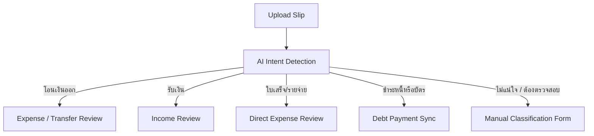

# TangLak: Slip-First Upload & Transaction Entry UX Specification

This document details the user experience (UX), interface structure, and functional requirements for TangLak's pivot to a **slip-first transaction entry** model. By shifting from historic, bank-wide PDF imports to real-time, slip-based capture, we reduce user onboarding friction and make financial tracking a habit.

---

## 1. Core Philosophy & The Pivot

TangLak is moving away from the complex, error-prone import of historical bank statements. The new philosophy centers on **gradual, low-friction habit building**:
*   **Current Month Focus**: Users start tracking from the current month rather than importing months of historic statements. This removes the "historical debt clean-up" anxiety.
*   **Incremental slip uploads**: Slips and receipts are uploaded as they are created.
*   **Manual entry as a fast backup**: When no slip is available, users can log a transaction in seconds.
*   **Peaceful deprecation of statement imports**: Legacy import routes are gently decommissioned.

---

## 2. Upload Landing Page Design (`/upload`)

The `/upload` landing page is the primary entry point for capturing transactions. The visual style follows a premium, high-fidelity dark-mode-friendly color palette (slate/indigo/warm charcoal) rather than typical bank green.

### UI Layout & Hierarchy

```
+--------------------------------------------------+
|                     TangLak                      |
+--------------------------------------------------+
|  [Card: Start from This Month]                   |
|  "เริ่มบันทึกจากเดือนนี้... ไม่ต้องย้อนอดีตให้เหนื่อย" |
+--------------------------------------------------+
|                                                  |
|                  +------------+                  |
|                  |    Drag    |                  |
|                  |    &      |                  |
|                  |    Drop    |                  |
|                  +------------+                  |
|                                                  |
|            [Primary CTA: อัปโหลดสลิป]              |
|                                                  |
+--------------------------------------------------+
|            [Secondary CTA: เพิ่มรายการเอง]           |
+--------------------------------------------------+
```

### Key Elements & Copystyle
1.  **Welcome & Value Proposition Card**:
    *   *Copy*: "เริ่มบันทึกจากเดือนนี้ อัปโหลดสลิปหรือใบเสร็จทีละใบเพื่อสร้างนิสัยการออม ไม่ต้องเสียเวลาจัดการไฟล์ย้อนหลัง"
    *   *Design*: A soft indigo tinted card (`bg-indigo-50/10` in dark mode) with a clean, friendly font.
2.  **Primary Action Area (Drag & Drop / File Selector)**:
    *   *Button Label*: `อัปโหลดสลิป` (Upload Slip)
    *   *Visuals*: Large, rounded touch target (minimum 44px, preferably 64px tall on mobile), styled with a subtle pulse animation on hover/tap. Uses solid indigo/charcoal with no green colors.
    *   *Support Text*: "รองรับรูปภาพสลิปธนาคาร (.jpg, .png) หรือใบเสร็จดิจิทัลทั่วไป"
3.  **Secondary Action**:
    *   *Button Label*: `เพิ่มรายการเอง` (Add Manually)
    *   *Visuals*: A clean bordered button underneath the primary CTA, offering immediate access to manual form logging if a slip is not available.

---

## 3. Slip Intent Recognition & Routing

When an image is uploaded, TangLak's AI extracts financial data and categorizes the transaction into one of **five distinct slip intents**. This determines how the transaction is reviewed and processed:



### Intent Details
1.  **โอนเงินออก (Transfer Out)**:
    *   *Definition*: A standard bank transfer slip representing money moving to an external merchant or individual.
    *   *Action*: Prompts the user to confirm the category (e.g., Food, Travel) and account source.
2.  **รับเงิน (Transfer In)**:
    *   *Definition*: Incoming funds (salary, peer-to-peer transfers, dividends).
    *   *Action*: Populates the income form, matching the recipient name as the user.
3.  **ใบเสร็จ/รายจ่าย (Receipt / Direct Expense)**:
    *   *Definition*: Store receipts, utility bills, or delivery screenshots (e.g., GrabFood, Shopee invoices).
    *   *Action*: Focuses on line items, subtotals, and vendor categories.
4.  **ชำระหนี้หรือบัตร (Debt or Card Payment)**:
    *   *Definition*: Transfer slips to credit card accounts, loan creditors, or installment plans.
    *   *Action*: Automatically triggers **Debt Linkage UI**, allowing the payment to offset an outstanding debt balance.
5.  **ไม่แน่ใจ / ต้องตรวจสอบ (Unsure / Needs Review)**:
    *   *Definition*: Damaged files, non-standard layouts, or ambiguous transfer details.
    *   *Action*: Flags the review form with a warning banner, requesting the user to classify the transaction manually.

---

## 4. Legacy Statement Route Deprecation

To guide users away from full statement imports without causing frustration, the legacy import page (`/history-import`) is replaced with a **calm, clean deprecation screen**.

### UI Elements
*   **Deprecation Banner**: A prominent but soft orange/charcoal alert card (not red/green) informing users that importing raw statements is deprecated.
*   **Deprecation Copy**:
    > **เราเปลี่ยนวิธีการจัดการข้อมูลเพื่อชีวิตที่ง่ายขึ้น**
    > TangLak เปลี่ยนมาใช้ระบบเน้นการบันทึกสลิปปัจจุบันแบบวันต่อวัน เพื่อช่วยให้คุณเห็นภาพรวมการใช้จ่ายที่แท้จริงและสร้างนิสัยการเงินที่ดีได้ง่ายขึ้น โดยคุณไม่ต้องวุ่นวายกับการจัดระเบียบไฟล์ธนาคารย้อนหลัง
*   **Action Paths**:
    1.  `อัปโหลดสลิป` (Primary CTA - Redirects to `/upload`)
    2.  `เพิ่มรายการเอง` (Secondary CTA - Opens manual entry form)
    3.  `กลับหน้าวันนี้` (Tertiary Text Link - Redirects to dashboard `/today`)

---

## 5. Mobile Viewport Layout & Responsiveness

To ensure accessible rendering on mobile browsers, all elements must reflow cleanly across standard viewports.

### 360px Viewport (e.g., Samsung Galaxy S8/S20)
*   **Font Scaling**: Primary headings scale down to `text-lg` (18px) to prevent multi-line wrapping of key figures.
*   **CTA Placement**: Buttons stack vertically. Margins compress from `my-6` to `my-3`.
*   **Header Card**: Value proposition card reduces padding to `p-3` and hides optional decorative icons.
*   **Touch Targets**: Buttons remain at `h-11` (44px) to respect touch compliance while saving vertical viewport space.

### 390px Viewport (e.g., iPhone 12/13/14)
*   **Standard Layout**: Default view container padding at `px-4`. Headings at `text-xl`.
*   **Buttons**: Side-by-side or stacked based on emphasis.
*   **Scroll Bounds**: Ensure vertical heights allow form fields and the bottom navigation bar to display without overlap.

### 430px Viewport (e.g., iPhone 14/15 Pro Max)
*   **Spacious Layout**: Card containers increase horizontal padding to `px-6`.
*   **Grid Cards**: Minor details can split into 2-column small grid cards (e.g., File name, upload size metadata).
*   **Typography**: Headings display at full `text-2xl` size.
